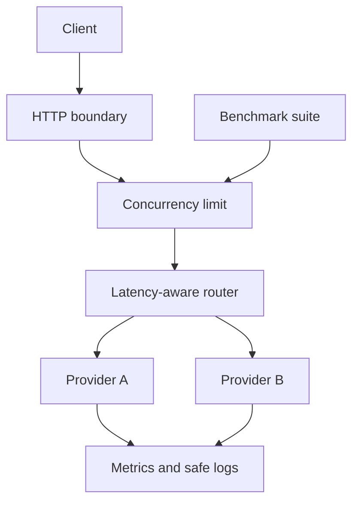

# Agent Gateway Go

[](https://github.com/ryewmn/agent-gateway-go/actions/workflows/ci.yml)

A production-minded AI model gateway and objective tool-call benchmark written with the Go standard library. It demonstrates the engineering around AI systems that matters after a prototype: routing, resilience, concurrency control, safe telemetry, deterministic evaluation, and regression gates.

No paid API is required. Two deterministic mock providers make the full gateway and benchmark reproducible in CI.

## What this demonstrates

- OpenAI-compatible-style `POST /v1/chat/completions` boundary
- Weighted, latency-aware routing with queue-pressure balancing
- Per-attempt timeouts, provider failover, retries, and circuit breakers
- Bounded concurrency and explicit overload responses
- Cryptographically random request IDs and prompt-safe structured logs
- Liveness, readiness, and Prometheus text metrics without a metrics dependency
- Configurable mock and HTTP OpenAI-compatible providers
- Exact tool name and JSON argument evaluation
- Abstention accuracy, multi-step success, error count, p50, and p95 latency
- Deterministic failure injection and regression thresholds
- Race-aware implementation with tests designed for `go test -race`

## Architecture



The router scores each healthy route using observed latency, configured weight, and in-flight requests. A failed attempt opens the route's circuit after a threshold and retries on a different provider. See [Architecture](docs/ARCHITECTURE.md).

## Quick start

Requires Go 1.23+.

```bash
go run ./cmd/gateway -config configs/local.json
```

In another terminal:

```bash
curl -sS http://localhost:8080/v1/chat/completions \
  -H 'Content-Type: application/json' \
  -d '{
    "model":"demo",
    "messages":[{"role":"user","content":"CALL:get_weather {\"city\":\"Austin\"}"}],
    "tools":[{"type":"function","function":{"name":"get_weather","parameters":{"type":"object"}}}]
  }'
```

Operational endpoints:

```bash
curl -sS http://localhost:8080/healthz
curl -sS http://localhost:8080/readyz
curl -sS http://localhost:8080/metrics
```

Run the objective benchmark:

```bash
go run ./cmd/benchmark -suite configs/benchmark.json
```

Exercise failover by failing every second primary request:

```bash
go run ./cmd/benchmark -fail-every 2
```

Force a regression gate to fail deterministically:

```bash
go run ./cmd/benchmark -quality 60 -min-exact 0.95
```

## Example benchmark result

The checked-in deterministic suite should produce results similar to:

| Metric | Result | Gate |
|---|---:|---:|
| Exact tool-call accuracy | 100% | >= 95% |
| Abstention accuracy | 100% | >= 95% |
| Multi-step success | 100% | >= 90% |
| Provider errors | 0 | Reported |
| p50 case latency | ~5 ms | <= 250 ms p95 |
| p95 case latency | ~10 ms | <= 250 ms |

Latency depends on the host. The command exits nonzero when any quality or latency threshold regresses, so it can gate pull requests.

## Configuration

`configs/local.json` runs entirely offline. `configs/providers.example.json` shows an HTTP upstream. API keys are named by environment variable, never stored in configuration:

```json
{
  "name": "local-model-server",
  "type": "openai-compatible",
  "endpoint": "http://localhost:11434/v1/chat/completions",
  "api_key_env": "LOCAL_MODEL_API_KEY",
  "weight": 1.0
}
```

Provider weights influence routing without disabling latency feedback. Mock providers support `latency`, `fail_first`, `fail_every`, and `tool_quality` for repeatable chaos tests.

## Docker

```bash
docker compose up --build
```

The container runs as a non-root user with a read-only filesystem in Compose.

## Development

```bash
make test
make race
make vet
make benchmark
```

CI runs unit tests, the race detector, `go vet`, and the benchmark regression gate. The project intentionally uses only the standard library, reducing supply-chain surface and keeping the mechanics visible.

## API behavior

This implements a focused compatibility boundary, not every OpenAI API field. Unknown request fields are accepted, while required fields and size limits are validated. Errors use a stable JSON envelope and include the response's `X-Request-ID`.

The gateway never logs prompt text, completions, tool arguments, authorization headers, or API keys. Metrics use provider names from trusted startup configuration to avoid unbounded labels.

## Limitations

- Streaming responses and embeddings are not implemented.
- Circuit breaker state and latency estimates are process-local.
- HTTP upstream compatibility is limited to the modeled chat fields.
- Authentication, tenant quotas, and distributed rate limiting belong at an ingress or future auth layer.
- Benchmark mocks test evaluation and gateway behavior, not real-model quality.
- Retries intentionally use a different provider and do not retry non-idempotent tool execution.

## Roadmap

- Server-sent event streaming with cancellation propagation
- Model capability and cost-aware policies
- OpenTelemetry traces with explicit content redaction
- Distributed circuit state and per-tenant token budgets
- Signed benchmark datasets and historical trend output
- Real-provider adapters behind opt-in integration tests
- Kubernetes manifests and horizontal load tests

## Documentation

- [Architecture](docs/ARCHITECTURE.md)
- [Threat model](docs/THREAT_MODEL.md)
- [Benchmark methodology](docs/BENCHMARK.md)
- [Contributing](CONTRIBUTING.md)
- [Security policy](SECURITY.md)

## License

MIT
