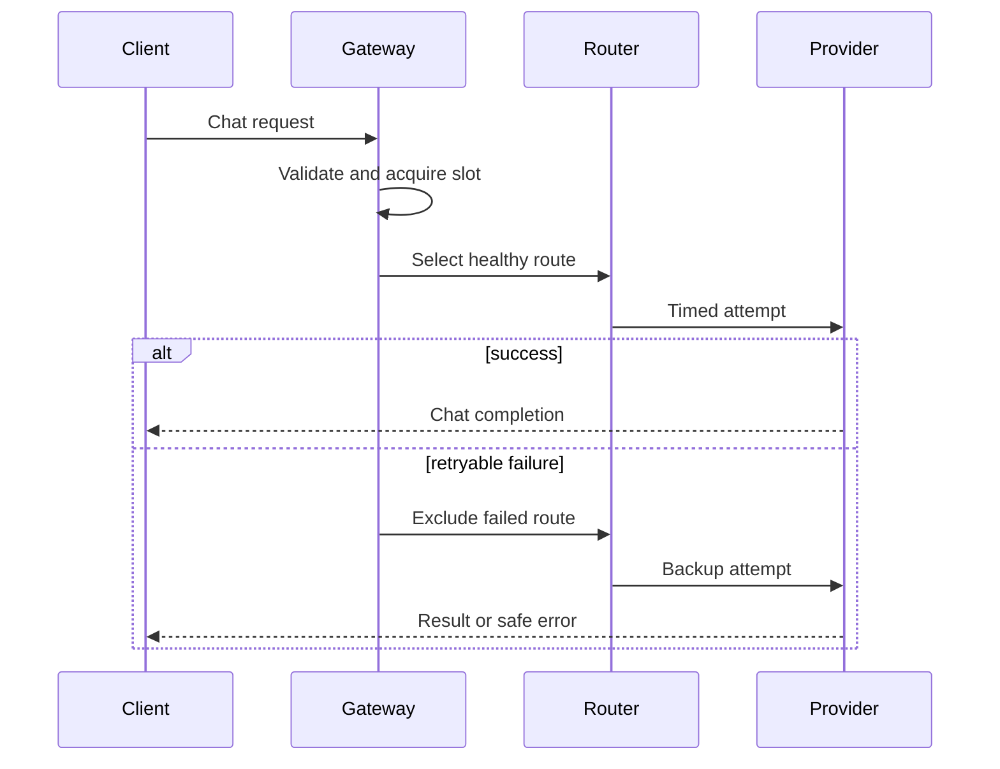

# Architecture

## Goals

The gateway provides a small, inspectable reference for resilient model access. It prioritizes bounded resource use, deterministic behavior under failure, and measurable agent quality over broad API coverage.

## Request path

1. The HTTP layer caps the body at 1 MiB, validates bounded messages and tools, and assigns a random request ID.
2. A non-blocking semaphore rejects excess concurrency rather than allowing an unbounded queue.
3. The router considers circuit state, exponentially weighted latency, route weight, and current in-flight work.
4. Every attempt gets its own deadline. Retries exclude providers already attempted for that request.
5. Success resets the circuit. Failure contributes to the opening threshold.
6. Logs record only request metadata. Metrics expose bounded labels.

## Concurrency model

Providers are required to be safe for concurrent calls. Each route protects its EWMA and in-flight count with a mutex. Circuit state has an independent mutex. Metrics snapshot under a lock and render after copying. Counters that need no grouped consistency use atomics.

The half-open circuit permits one trial request. This prevents a recovering backend from receiving a surge. The process-wide semaphore bounds simultaneous end-to-end requests.

## Routing policy

The score is:

`score = ewma_latency * (in_flight + 1) / weight`

The lowest eligible score wins. A larger weight expresses preference, while latency and queue pressure still allow traffic to shift. This is intentionally understandable rather than an opaque optimizer.

## Failure semantics

- Client cancellation propagates through provider calls.
- A deadline applies per upstream attempt.
- A failed route is not tried twice for one request.
- Circuit opening is local to one process.
- Overload is returned as `503 busy`.
- No healthy route is returned as `503 no_provider`.
- Other exhausted upstream errors become a redacted `502 upstream_error`.

## Extension points

Implement `provider.Provider` for another upstream. Keep provider-specific credentials and response translation within that package. New routing strategies can operate over `Route` without changing HTTP or benchmark code.
