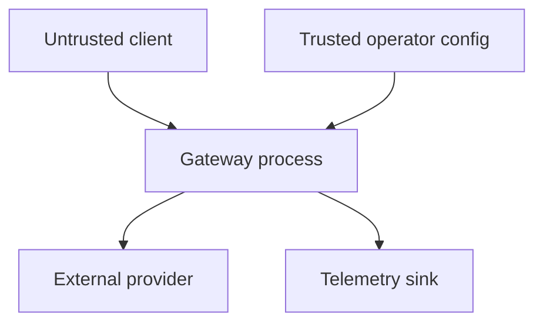

# Threat model

## Scope and assets

The system accepts model prompts and tool definitions, forwards them to configured providers, and returns model output. Assets include provider credentials, prompt and completion confidentiality, service availability, routing integrity, benchmark integrity, and telemetry trustworthiness.

The default deployment assumes a trusted operator configures providers. It does not assume callers or provider responses are trustworthy.

## Trust boundaries

## STRIDE analysis

| Threat | Example | Current control | Residual risk / next control |
|---|---|---|---|
| Spoofing | Caller impersonates a tenant | None claimed | Put OIDC or mTLS at ingress; add tenant context |
| Tampering | Modified provider config | Config is local and strict-decoded | Signed config and deployment attestation |
| Repudiation | Caller disputes a request | Random request IDs and timestamped logs | Authenticated actor IDs and tamper-evident storage |
| Information disclosure | Prompts or keys leak in logs | Logger accepts metadata only; upstream errors are redacted | Sink access controls and automated log scanning |
| Denial of service | Large bodies or request floods | 1 MiB body cap, item limits, deadlines, concurrency cap | Edge rate limits and per-tenant quotas |
| Elevation of privilege | Model induces dangerous tool execution | Gateway returns calls but executes no tools | Separate policy-enforcing tool runtime and approval gates |

## AI-specific threats

- Prompt injection: the gateway does not treat model output as authority and does not execute tool calls.
- Tool confusion: benchmark scoring requires exactly one expected name and semantically exact JSON arguments.
- Unsafe over-action: benchmark cases measure abstention when tools should not be used.
- Provider compromise: response sizes are bounded and errors are redacted, but schema depth is not separately limited.
- Cross-tenant leakage: there is no response cache or conversation persistence. Future caching must include tenant isolation.
- Evaluation gaming: deterministic directives are only a test fixture. Production model evaluation needs held-out, versioned cases.

## Credential handling

API keys are read from named environment variables. They are never included in config examples, provider errors, logs, or metrics. Production deployments should use a secret manager, rotate keys, restrict egress, and use separate keys per provider and environment.

## Security invariants

1. Request or response content is never written to application logs.
2. No request can create arbitrary metric labels.
3. Each upstream attempt is cancellable and time-bounded.
4. The gateway never executes returned tool calls.
5. Error responses do not expose upstream response bodies.

See [SECURITY.md](../SECURITY.md) for reporting vulnerabilities.
